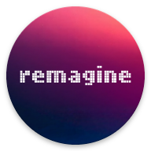
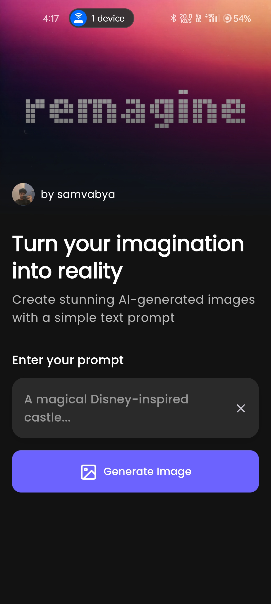

    
    <h1>remagine</h1>
    
Text to Image Generation AI API

---

  

## Features
- AI image generation through text prompt

## Installation

## Tech Stack

**Client:** Flutter, Android, Web

**APIs:** Imagine Art API by Midjourney
